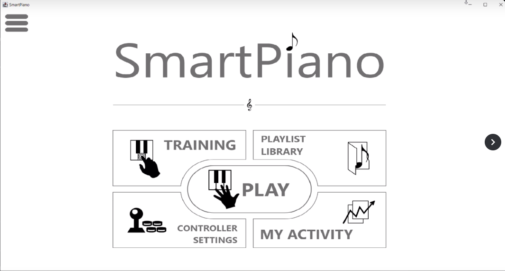
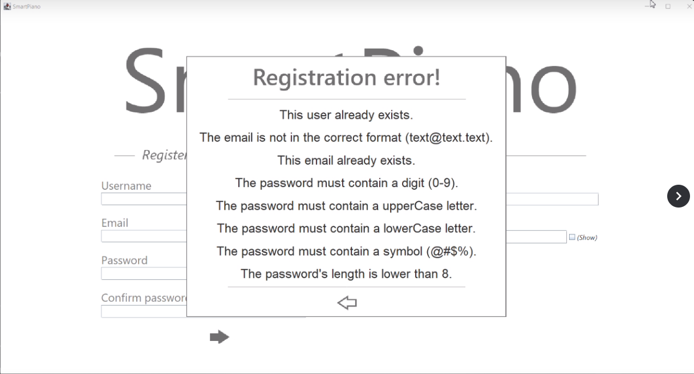
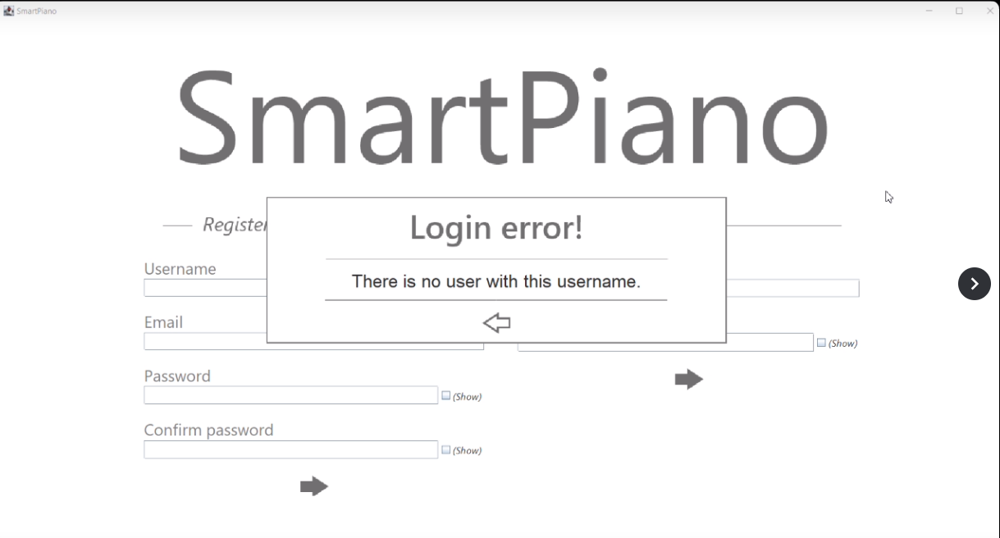
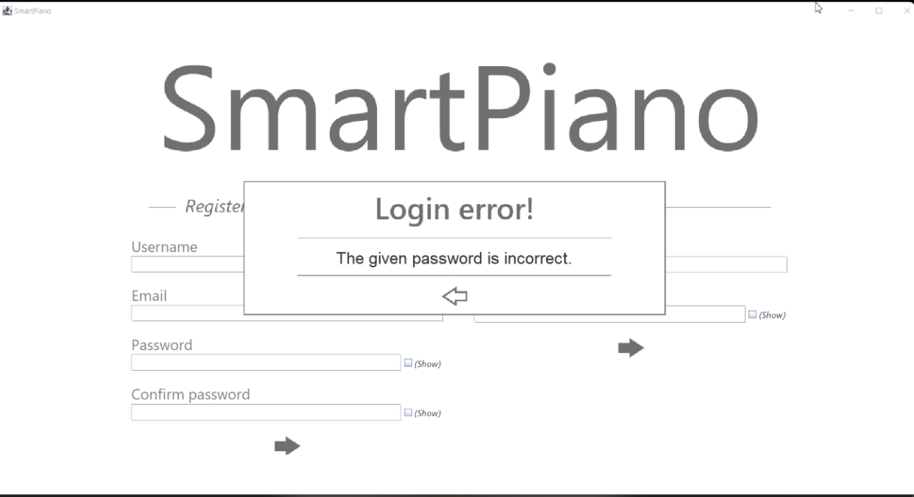
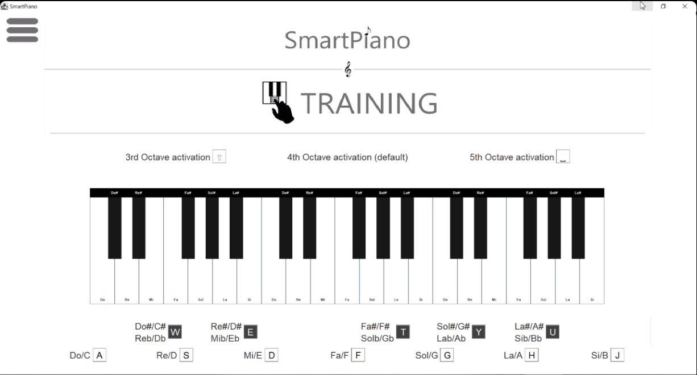
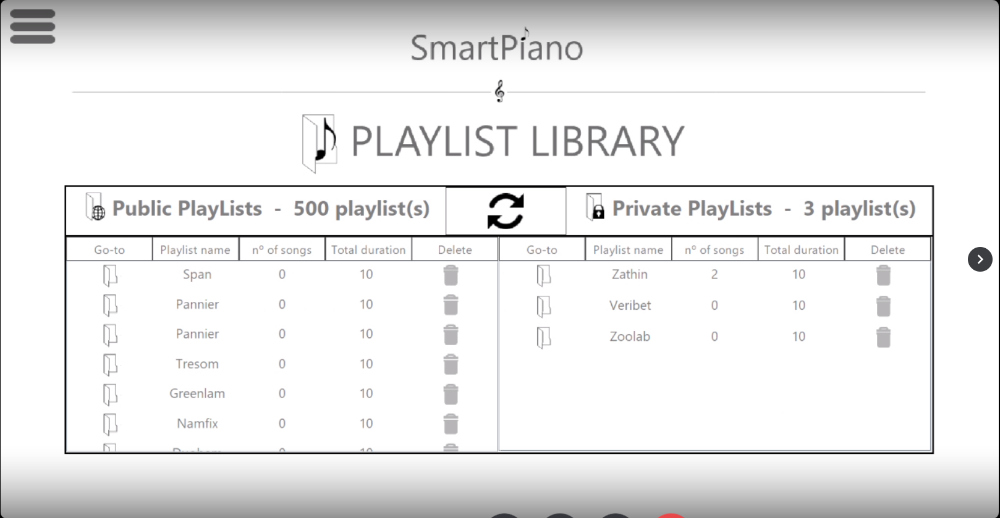
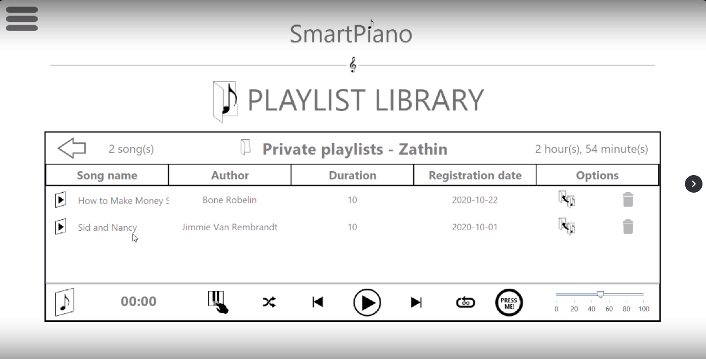
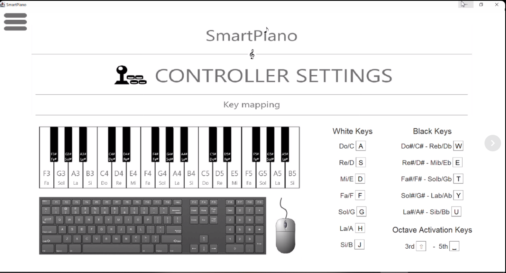
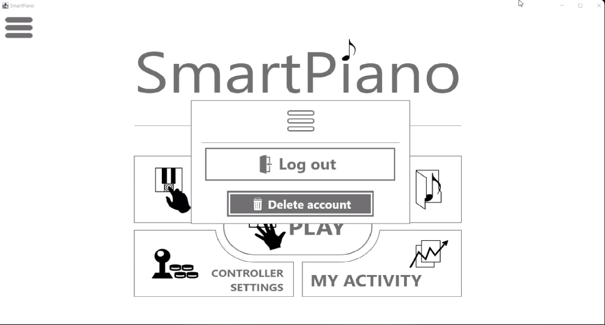
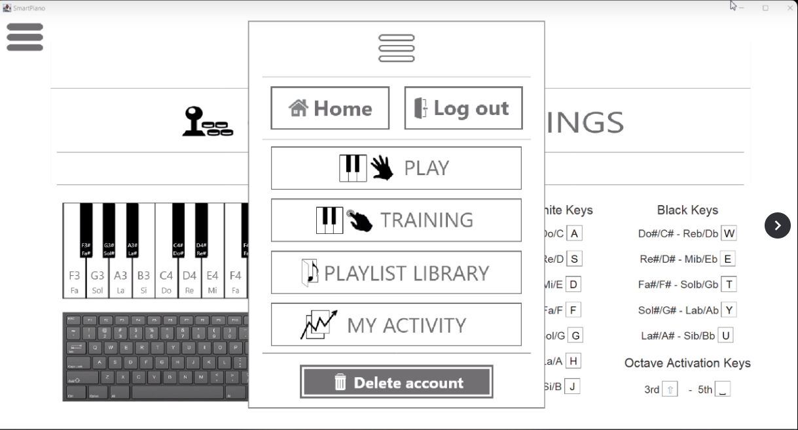

# SmartPiano
Object Oriented Programming project focused on creating a digital piano application developed in Java as well as Java Swing, a GUI widget toolkit. The goal was to replicate a real life piano's functionality of playing the keys as well as having the option to allow recording a song, save it with info. fields, play it on a player, etc.

Step 1: Create the BBDD in MySql Workbench (follow the README steps accordingly)

Step 2: Open the project in IntellIj

Step 3: Add the libraries if necessary to the project (they are located in the lib folder)
